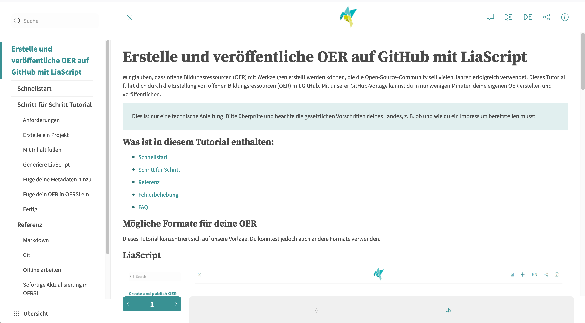

<!--
author:   Jörg Lohrer

version:  0.1.0
language: de
narrator: Deutsch Weiblich

date:     2024-08-13

logo:     https://raw.githubusercontent.com/TIBHannover/oer-github-tutorial-liascript/main/img/preview.png

tags:     OER, Git, GitHub, Tutorial, LiaScript

comment:  Dieses Tutorial zeigt, wie man OER einfach auf GitHub mit LiaScript veröffentlicht.
          In nur wenigen einfachen Schritten kannst du deine eigenen OER erstellen, kostenlos
          auf GitHub veröffentlichen und sie in unseren OER-Suchindex OERSI in weniger als
          fünf Minuten aufnehmen!

@attribute

Comenius-Institut

Lizenz: <a target="_blank" href="https://creativecommons.org/licenses/by/4.0/deed.de">CC BY 4.0 DEED</a>

@end

@style
section {
  margin-top: 1em;
  margin-bottom: 1em;
}
@end

-->

# OER auf GitHub mit LiaScript erstellen und veröffentlichen

Wir glauben, dass offene Bildungsressourcen (OER) mit Werkzeugen erstellt werden können, die die Open-Source-Community seit vielen Jahren erfolgreich verwendet. Dieses Tutorial führt dich durch die Erstellung von offenen Bildungsressourcen (OER) mit GitHub. Mit unserer GitHub-Vorlage kannst du in nur wenigen Minuten deine eigenen OER erstellen und veröffentlichen.

> Dies ist nur eine technische Anleitung. Bitte überprüfe und beachte die gesetzlichen Vorschriften deines Landes, z. B. ob und wie du ein Impressum bereitstellen musst.

<section>

## Was ist in diesem Tutorial enthalten:

* [Schnellstart](#quick-start)
* [Schritt für Schritt](#requirements)
* [Referenz](#reference)
* [Fehlerbehebung](#troubleshooting)
* [FAQ](#faq)

</section>

<section>

## Mögliche Formate für deine OER

Dieses Tutorial konzentriert sich auf unsere Vorlage. Du könntest jedoch auch andere Formate verwenden.

</section>

<section>

## LiaScript

LiaScript ist das, womit dieses Tutorial erstellt wurde. Alles, was für die Anzeige deiner OER mit LiaScript erforderlich ist, ist eine Markdown-Datei, die irgendwo gehostet wird. Es ist der schnellste und einfachste Weg zu deinem ersten OER.

[Gehe zu LiaScript](https://liascript.github.io)

</section>

<section>

## Markdown-Dokumentenvorlage

 
 

Unsere Markdown-Dokumentenvorlage ermöglicht es dir, deine OER schnell auf GitHub Pages mit nur wenigen Schritten zu hosten. Eine Webseite sowie verschiedene Formate wie PDF und ePub werden automatisch mit jeder Änderung an deinem OER generiert.

Du kannst dieses Tutorial, das mit unserer Vorlage erstellt wurde, hier sehen: [Template OER Tutorial](https://tibhannover.github.io/oer-github-tutorial-template/)

[Unsere Vorlage auf GitHub ansehen](https://github.com/tibhannover/oer-github-tutorial-template/)

</section>

<section>

## JupyterBook

  

JupyterBook ist ein Programm, das schnell anpassbare Bücher erstellen kann. Es erlaubt sogar die Ausführung von Python-Code in Form von Jupyter-Notebooks.

Du kannst dieses Tutorial, das mit JupyterBook erstellt wurde, hier sehen: [Jupyter OER Tutorial](https://smatts.github.io/oer-tutorial-jupyter-book/00_intro.html)

[Gehe zu JupyterBook](https://jupyterbook.org)

> Nach Abschluss dieses Tutorials wirst du ein automatisch generiertes OER mit deinem eigenen Inhalt und Metadaten haben, das kostenlos auf GitHub veröffentlicht wird und bereit ist, in unseren OER-Suchindex [OERSI](https://oersi.org) aufgenommen zu werden.

</section>
